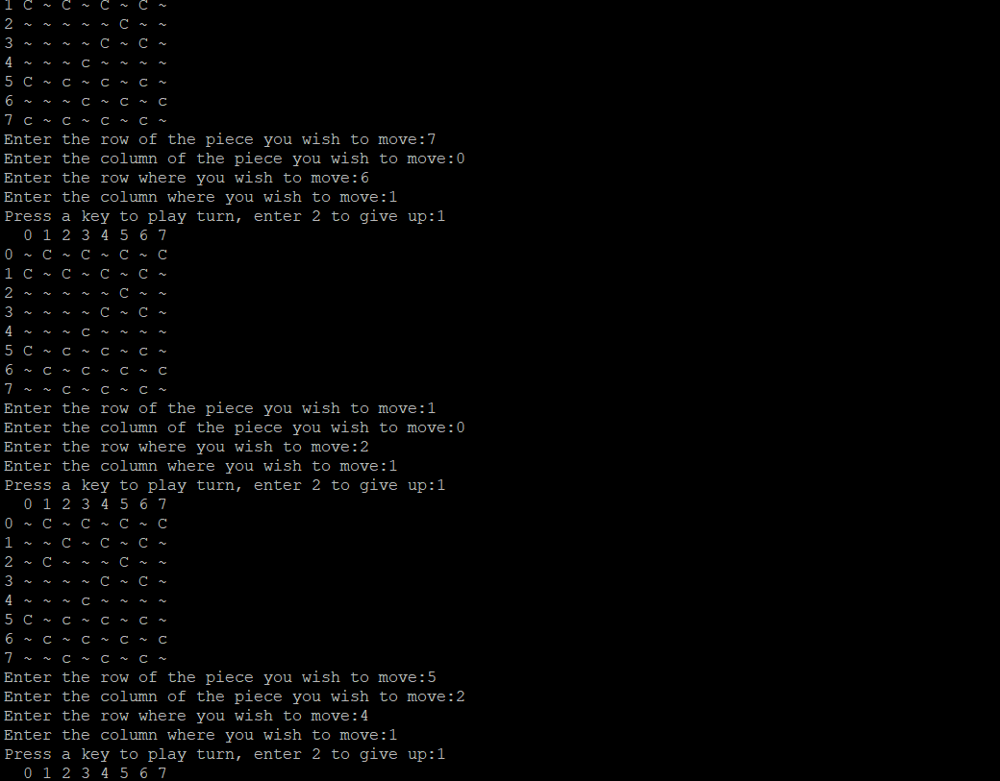
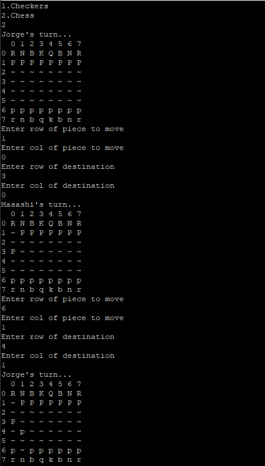
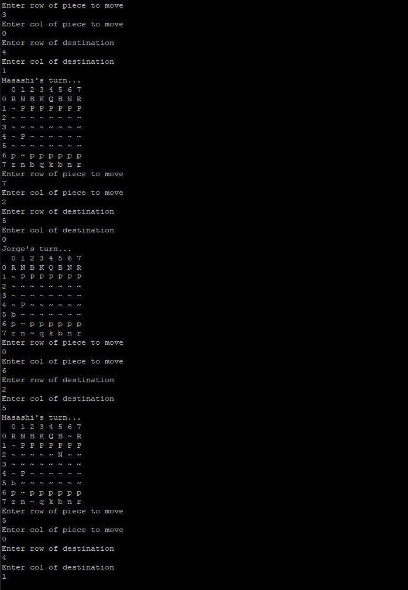
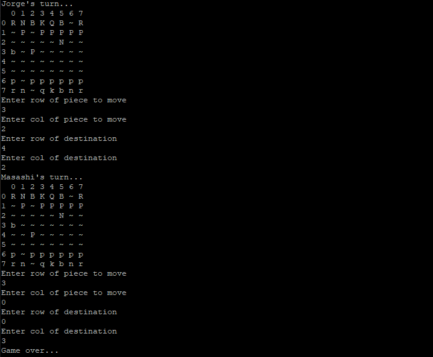
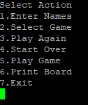

# \<Chess and Checkers\>
 
  Authors: \<[Thomas Gustafson ](https://github.com/tgustafson2)[Jorge Ruiz ](https://github.com/ruiz-jorge)[Masashi Yamaguchi](https://github.com/myama048)\>
 

## Project Description
  We thought it would be interesting to implement a program that would allow users to play chess or checkers.  This would allow users to explore an old classic. We will implement the project using C++, classes, and inheritance.  The input will be the users names, what game they want to play, and what moves they want to make. The output will be a visual representation of the board and pieces, prompting user input, and declaring a winner.

  Abstract Factory

  We will use Abstract Factory by implementing a generic class for the game pieces. Each piece will have generic attributes and then they will be overwritten in the concrete classes for each specific piece. This will allow for different pieces to easily be added in the future.

Strategy

  We will use Strategy by defining multiple algorithms to let users pass the algorithm to be used as a parameter. The movement of each piece can be implemented differently. Every character will have its own move() implementation. This way, there is no code reusability and we can not change the implementation at run time

  Proxy

  We will use proxy to take user decisions and act on the particular game being played. It will also give the option to create a new game or simply quit.  It will contain a pointer to the game class and implements the interface.

## Class Diagram

Our proxy pattern will be acting upon our game class that will be instatiated as one of the 3 concrete classes.  The game class will be the abstract factory, depending on which game is chosen it will create different pieces to be used.  The strategy class will take the move input and validate that the move is possible for the given piece.

 > ## Final deliverable
## Screenshots

## Installation/Usage
 To install our project on hammer type the following commands:
 git clone --recursive https://github.com/cs100/final-project-tgust002-jruiz096-myama048.git
 cmake3 .
 make
 To be able to play a game of chess or checkers enter the command:
 ./play
 To be able to to test that all classes our working correctly enter the command:
 ./test
## Testing
 To test the project we wrote our own google unit tests on each of our own branches, when a merge request was made the reviewer was responsible for checking if any of the existing tests had any changes.  We used both drivers and stubs depending on what the situation called for.
 
